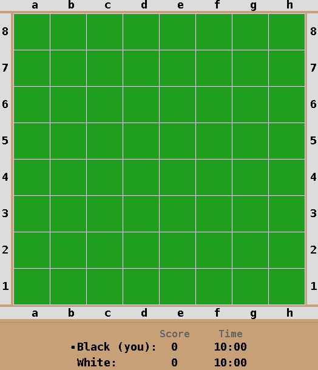

# Reversi AI

This AI has been made to play the game [Reversi](https://en.wikipedia.org/wiki/Reversi) (also know as Othello).

The algorithm consists of a [minimax](https://en.wikipedia.org/wiki/Minimax) search (with [alpha-beta pruning](https://en.wikipedia.org/wiki/Alpha%E2%80%93beta_pruning)) to simulate the possibilities of the board in the future.
We assume that the opponent will make optimal moves, which allows up to search deaper into the future of possibilities in order to try and make the most optimal move.

We use a heuristic function to try and rate the state of each board.
The function incorporates four elements in order to rate each board (which are all weighted differently):
- The ratio of our score to our opponent’s score
- The ratio of mobility (how many moves were available to us vs. how many were
available to our opponent)
- The ratio of corner squares taken by each player
- The ratio of X and C squares taken by each player.

With this heuristic of the board, we attempt to predict the players movements, look into the future, and pick the best possible move.

For a full explanation, see the [report](Reversi%20Artificial%20Intelligence%20Writeup.pdf).

See [reversi_bot.py](ReversiBot_Python3/reversi_bot.py) for the implementation.

## Results

Our algorithm performs very well againsts random behavior, human players, and other AIs.
In a tournament of 60 classmates, our AI placed in 2nd place (yay 🎉)!

See the below gifs for example of the AI playing the game:

#### AI (Black)  vs Random (White):

#### AI (White) vs Human (Black):

## How to Run

(For WSL, run XLaunch and set your display variable: `export DISPLAY=127.0.0.1:0.0`)

(Use `echo $DISPLAY` to make sure it is there)

- To run the server (in the _ReversiServer_ dir): `java Reversi 10`
- To run the bot client (in the _ReversiBot_Python3_ dir): `python3 reversi_python_client.py localhost 1`
- To run the human client (in the _ReversiHuman_ dir): `java Human localhost 2`
- To run the random client (in the _ReversiRandom_Java_ dir): `java RandomGuy localhost 2`
  - (or `python RandomGuy.py localhost 2` in the _ReversiRandom_Python_ dir)
